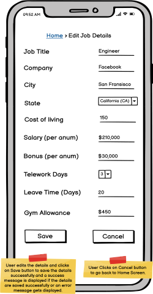

# Design Document

**Author**: CS6300 Fall 2021

## 1 Design Considerations

### 1.1 Assumptions
* Job Compare Adroid Application data will be persisted using local SQLite files. 
* This is a single-user Android application.
* The adjusted salary is calaculated as salary/index/100.

### 1.2 Constraints
* This is a single-user Andrdoid application. The user must use a phone that can run Android apps on it.
* Users cannot enter the Location State manually. The user must select the Location State from the dropdown.
* This application is tested on Emulator level "Pixel 4 XL" with API level "API 29: Android 10.0 (Q)"

### 1.3 System Environment
* Application OS and Platform: Android with minimum API 29: Android 10.0 (Q)
* Phone requirement: Must have Android OS with at least 2GB RAM. 4GB RAM is recommended.
* This application is tested on Emulator level "Pixel 4 XL" with API level "API 29: Android 10.0 (Q)"

## 2 Architectural Design
The application will follow MVC pattern in a simple manner to avoid added complexity. The architecture of the application is specified in the Component diagram.

### 2.1 Component Diagram
The component diagram for Job Compare can be given as follows. Application is divided into 3 parts 

1.  Presentation Layer (All the GUI and naviagtion logic visible to user will be applied in this layer). 
2. Middleware Layer (This layer works like a bridge between GUI and database displaying data based on users action and saving data to database upon click of Save buttons on the GUI). 
3. Persistance/Database Layer (This layer saves the data provided by user i.e. Offer Details/Job Details/Comparison Weights to be used for display).

### 2.2 Deployment Diagram
The application will be deployed as a single binary directly on an Android host. 
Due to this very simplistic architecture no deployment diagram is needed as we do not require multiple servers for deployment.

## 3 Low-Level Design
* Our low-level design is our team UML diagram that can be seen below. Our team UML design shows the classes, methods, attributes and relationships required for our Job Compare Android application.

### 3.1 Class Diagram

### 3.2 Other Diagrams
* There are no other low-level design diagrams.

## 4 User Interface Design

### 4.1 Home Page(Main Menu)
The design for Main Menu can be given as follows. User can Add/Edit Job details, Add/Edit Offer Details, Add Job Comparison weights and Perform Job Comparison.

### 4.2 Add/Edit Job Details
The design for Add Job details marked by the Enter/Edit Job Details button on Home page can be given as follows. Users can add or edit their current job details on this page. 
Users can also cancel the changes and save the changes after which they will be redirected to Home page. 

### 4.3 Add Offer Details
The design for Add Offer details marked by Enter Job Offers button on Home page can be given as follows.
Users can add offer details on this page. Users can save the changes to database(Save button), Go back to Home page(Back button), Add another offer details(Add Offer button)
and Compare the entered offer with current Job(Compare with Current Job button). 

### 4.4 Adjust Comparison weigths
The design of adjust comparison weights screen marked by the Adjust Comparison Settings button on home page can be given as follows.
Users can enter the comparison weights for all the weighted components on this screen in text boxes. They can save the weights on this page using Save button and can use Back button to go back to home screen.

### 4.5 Compare offers
The Compare offers functionality is split in 2 screens. When users click the Compare Job Offers button from home page they will be displayed a list of current job and job offers as follows
On the list page the users can select the jobs to choose by clicking on the check-boxes on left and click the compare button. 
Upon clicking the Compare button users will be displayed a side by side view of the details of offers for comparison.

After user clicks on Compare button on the List page Users will be displayed with the selected jobs for comparison. 

  

