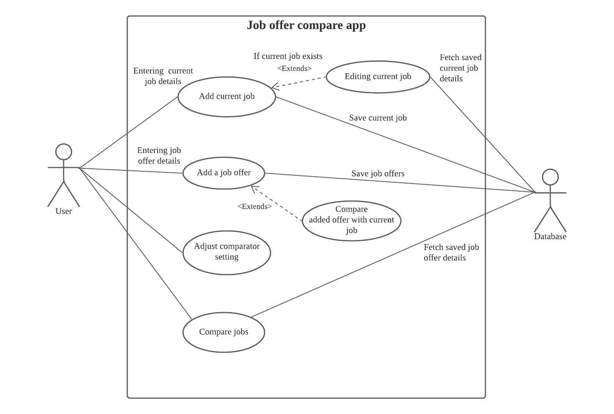

# Use Case Model

**Author**: Jing Liu

## 1 Use Case Diagram

## 2 Use Case Descriptions

| Use Case Title   | Add current job                                              |
| ---------------- | ------------------------------------------------------------ |
| Requirements:    | Use case display user the current job page for entering current job details if no current job exits. Or, it displays user the current job page with saved details and allows user to edit. This page include the two functional buttons, which are "Save ", " Cancel". System will check the format of details user input and shows error message if any blank is empty or filled with wrong formatted information. Then it  saves current job details with showing success message and display user the home page if each of the input is correct. Or, user can return to the homepage without saving details by clicking the " Exit without saving" button. |
| Pre-conditions:  | 1.There isn't current job detailed saved by the system. 2.User has to input the details in the correct format and no empty entry. |
| Post-conditions: | 1.System validates the input.                           2.Database save the current job details.                            3.System displays user the homepage.. |
| Scenarios:       | Normal:   1.User input the job details.                                                        2.User click the "Save" button.   3.System validates the details. 4.Database saves the details.                                 5.System shows a success message.                                              6.System displays the homepage  Alternative: 1.User clicks the “Cancel” button.  2.System displays the homepage. Exceptional:                                                            1.User input the job information incorrectly.              2.Invalid information. System shows an error message icon. |

| Use Case Title   | Edit current job                                             |
| ---------------- | ------------------------------------------------------------ |
| Requirements:    | Use case displays user the current job page with saved details and allows user to edit. This page include the two functional buttons, which are "Save", "Cancel". |
| Pre-conditions:  | 1.Current job detailed is saved by the system. 2.User has to input the details in the correct format and no empty entry. |
| Post-conditions: | 1.System validates the input.                           2.Database update and save the current job details.                            3.System displays user the homepage. |
| Scenarios:       | Normal:   1.User edit the job details.                                                        2.User click the "Save" button.   3.System validates the details. 4.Database saves the details.                                 5.System shows a success message.                                              6.System displays the homepage  Alternative: 1.User clicks the “Cancel” button.  2.System displays the homepage. Exceptional:                                                            1.User input the job information incorrectly.              2.Invalid information. System shows an error message icon. |

| Use Case Title   | Add job offer                                                |
| ---------------- | ------------------------------------------------------------ |
| Requirements:    | Use case display user the job offer page for entering job offer details. This page include the four functional buttons, which are "Save", "Back", "Add offer", "Compare With Current Job". System will check the format of details user input and shows error message if any blank is empty or filled with wrong formatted information. Then it saves job offer details and shows success message. |
| Pre-conditions:  | 1.User has to input the details in the correct format and no empty entry. |
| Post-conditions: | 1.System validates the input. 2.Database saves the job offer details. 3.System shows "success" message. |
| Scenarios:       | Normal:   1.User enter the job offer details.                                                        2.User click the "Save" button.   3.System validates the details. 4.Database saves the details.                                 5.System shows a success message.                                              Alternative(*a.* *Return to the homepage*): 1.User clicks the "Back" button.  2.System displays the homepage. Alternative(*b.* *Enter another job offer*): 1.User clicks the "Add offer" button.  2.System displays a brand new job offer page. Exceptional:                                                            1.User input the job information incorrectly.              2.Invalid information. System shows an error message icon. |

| Use Case Title   | Compare offer with current job                               |
| ---------------- | ------------------------------------------------------------ |
| Requirements:    | After successfully saving the job offer, user can compare it with the current job by clicking the "Compare With Current Job" button. Use case displays user a comparison page for current job and the saved job offer side by side. This page includes all the details compared side by side. And the current job will be noted. Also this page includes two buttons: "Compare More Offers" and "Home". "Compare More Offers" button brings user to a " job ranking" page. This page shows a list of job offers(including the current job if present), displayed as Title and Company, ranked from best to worst. "Home" button bring user back to the homepage. |
| Pre-conditions:  | 1.Current job details is saved in the system. 2.User has to save the job offer first. 3.User has to click the "Compare With Current Job" button. |
| Post-conditions: | System displays user the comparison page for current job and the saved job offer. |
| Scenarios:       | Normal:  1.User clicks the "Compare With Current Job" button.  2.System checks that the offer details was saved.  3.System checks the existence of the current job. 4.System displays  the comparison page. 5.User clicks the  "Back" button. 6.System displays the homepage. Alternative: 1.User clicks the  "Compare More Offers" button on the comparison page. 2.System displays  a "job ranking" page. |

| Use Case Title   | Adjust comparator setting                                    |
| ---------------- | ------------------------------------------------------------ |
| Requirements:    | Use case display user a comparison setting page for adjustment of  the weights :                                   1.Yearly salary 2.Yearly bonus 3.Allowed weekly telework days 4.Leave time 5.Gym membership allowance They are all assigned 1 as the default setting. User has to assign non-empty integer to these weight. Then press the "Save" button to save the edited value. Or, user can return to the homepage with the "Back" button. |
| Pre-conditions:  | 1.User has to assign non-empty integer to these weight.      |
| Post-conditions: | 1.System checks the validation of the adjustment  2.System saves the adjustment after validation. 3.System shows the success message. |
| Scenarios:       | Normal:  1.User adjusts the weight value as integers. 2.User clicks the "Save" button. 3.System validates the input. 4.System saves the values. Alternative: 1.User adjusts the weight value as integer. 2.User clicks the  "Back" button. 3.System displays the user homepage without adjustment.                                                                       Exceptional:  1.User make invalid input . 2.User clicks the "Confirm" button. 3.System shows the error message. |

| Use Case Title   | Compare jobs                                                 |
| ---------------- | ------------------------------------------------------------ |
| Requirements:    | Use case will fetch saved job offer list from database and validate the total number of saved job offers. With saving at least two job offers(one job offer with current job existence), system displays user a " job ranking" page. This page shows a list of job offers(including the current job if present), displayed as Title and Company, ranked from best to worst. Also, there are two buttons which are "Compare" and "Back" listed on the bottom. And use case allows user to select two jobs in the ranked job list. Then click the  "Compare" button for further comparison. Then system displays user the detailed "Two job comparison" page includes all the details from job offers. All of the details of the same team will be placed in the same row side by side. Two functional buttons-"Compare More Offers" and "Home" located on the bottom. "Compare More Offers" button brings user back to the " job ranking" page. "Home" button bring user back to the homepage. |
| Pre-conditions:  | 1.User has to save at least two job offers, or at least one job offer, in case there is a current job. 2.User has to select two job offers for further comparison. |
| Post-conditions: | 1.System displays user a  " job ranking" page with clicking the "Compare Job Offers" button. 2.System displays user a  "Two job comparison" page with clicking the "Compare" button. |
| Scenarios:       | Normal:  1.User clicks the "Compare Job Offers"  button from the home page. 2.System validate the numbers of current job and job offers.                                                                                                                                    3.System displays  the job ranking page. 4.User selects two job offers by clicking.  5.User clicks the "Compare" button. 6.System displays the detailed "Two job comparison" page. 7.User clicks the "Compare More Offers" button. 8.System displays the " job ranking" page. Alternative(*a. Return without further comparing* ):  1.User clicks the "Compare job offer"  button from the home page. 2.System validate the numbers of current job and job offers.                                                                                                                                    3.System displays  the " job ranking" page. 4.User clicks the "Home"  button 5.System displays  the homepage. Alternative(*b. Return after further comparing* ):  1.System displays the detailed "Two job comparison" page. 2.User clicks the  "Home" button. 3.System displays the homepage. Exceptional(*a. Number of saved jobs is smaller than 2.* ):  1.User clicks the "Compare job offer" button from the homepage. 2.System check the numbers of current job and job offers. It smaller than two.                                                                                                                                    3.System shows the error message. Exceptional(*a. Any number of jobs are selected but not two for detailed comparison. ):  1.User selects the job offers from the " job ranking" page. 2.User clicks the "Compare two jobs" button.  3.System checks the selected jobs.  4.System shows the error message. |

