# Job Compare Application User Manual

## Introduction

This application is a single-user android application that allows users to compare job offers. User can create new job offers and compare them easily using this application.

## User Manual Instructions to use the Job Compare Application

### 1. Start your android phone and click on the Job Compare Android application. You should see the below Main Menu screen with four buttons:

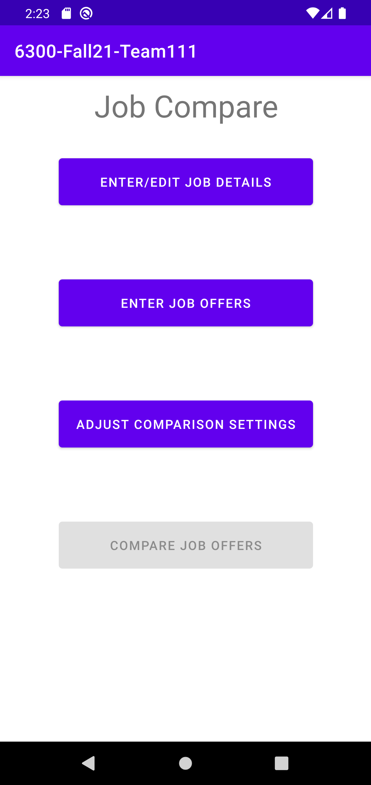

### 2. On the Main Menu screen, please choose one of the following four options:
(i) Enter/Edit Job Details   (ii) Enter Job Offers   (iii) Adjust Comparison Settings   (iv) Compare Job Offers (NOTE: Compare Job Offers option will be disabled when there is no current job already entered into the application)

### 3. Option (i): Enter/Edit Job Details - On this screen you can enter current Job Details. If you already entered a Job before, then this screen will open in Edit mode with all values pre-filled to allow you to make edits. See images below:

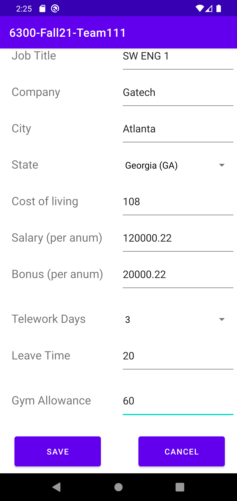

### 4. Option (i): Save Entered/Edited Job Details - Once you have entered or edited the Job Details, you can hit the Save button to save the data into the application. You should see the following prompt once you hit Save. If you click on "No", it will save but will keep you on the same screen and if you click on "Yes", it will save and take you back to the Main Menu Screen. If you click on Cancel, it will not Save and take you back to the Main Menu screen. NOTE - if you enter blank or invalid inputs and hit Save, you will see an error icon next to the invalid input. You must resolve this error icon for the Save to go through successfully:

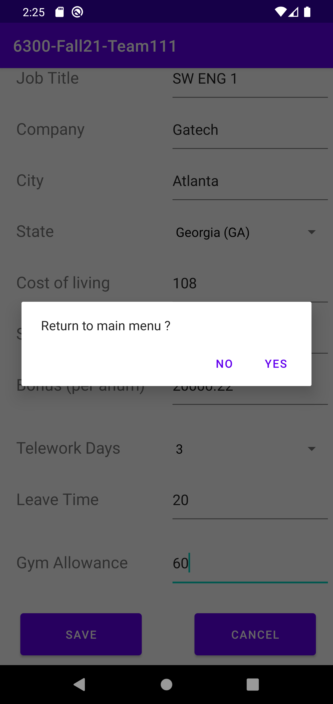   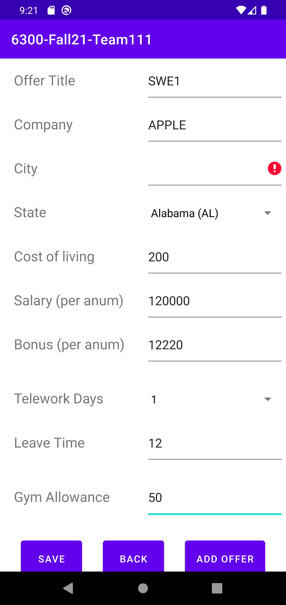   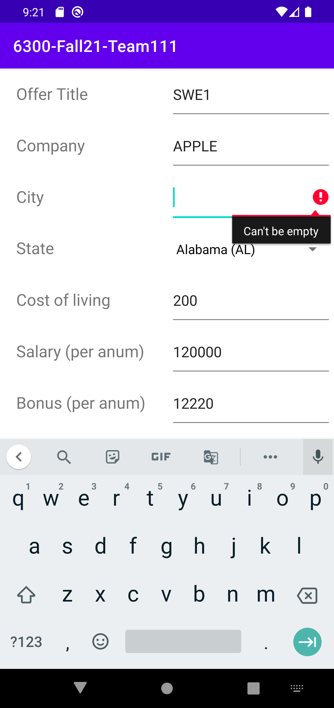

### 5. Option (ii): Enter Job Offers - On this screen you can enter a new Job Offer:

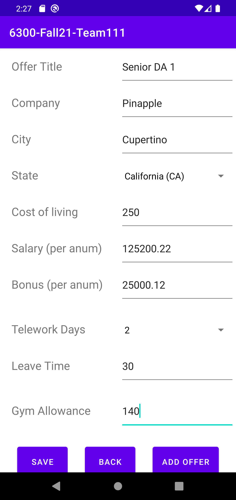

### 6. Option (ii): Save Entered Job Offer - Once you click on the Save button in the "Enter Job Offer" screen, it will validate and save the offer details into the application. It wll display any errors if you have any entry was entered incorrectly. NOTE - Only after you perform the Save and IF a current job exists is when the "Compare with Current Job" button will get enabled. The "Compare with Current Job" leads to the same screen as mentioned in step 10. Please see before and after save screenshots for reference:

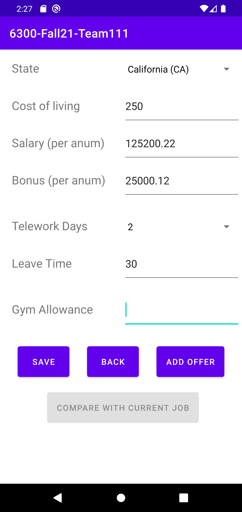   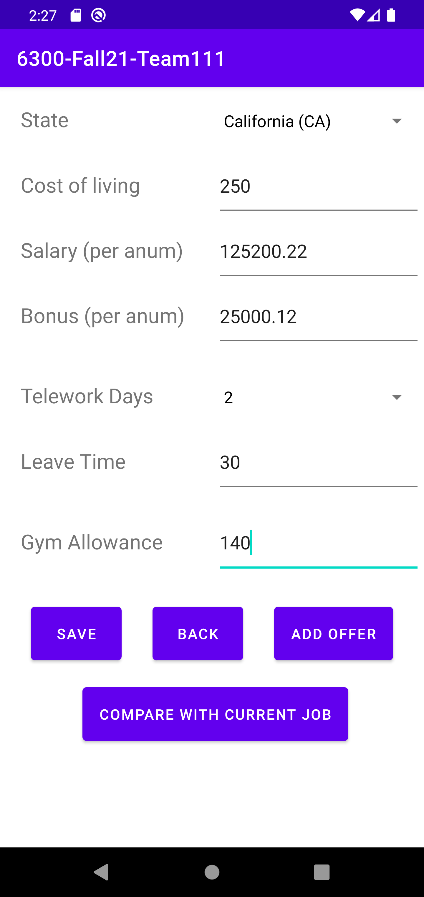

### 7. Option (iii): Adjust Comparison Settings - On this screen you can adjust the comparison settings for Salary, Bonus, Telework days, Leave Time and Gym Allowance. Please NOTE that these are integer weights and are integer weight 1 by default. Also note that a higher integer weight may be entered to prioritize a specific parameter or lower integer weight may be entered to de-prioritize it which directly impacts the sorting of the listed job offers within the "Compare Job Offers" screen:

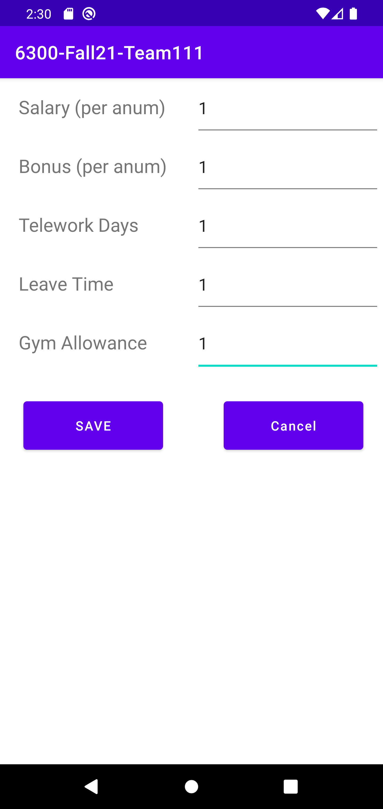

### 8. Option (iii): Save Adjusted Comparison Settings - Once you click on Save for your Adjusted Comparision settings, the edited setting values will be validated and saved into the application. If invalid entries are inputted (non-integer values), invalid entries will be displayed on the screen and save will not happen. If everything is saved and validated, then you should see a message saying "Comparison settings saved successfully":

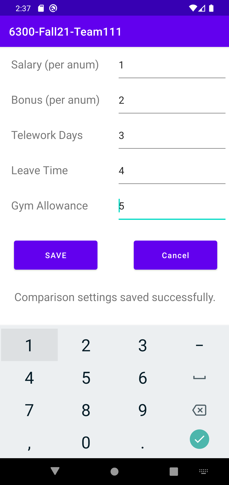

### 9. Option (iv): Compare Job Offers - You will be able to reach this screen only if you have a minimum of two jobs existing in the application. On this screen, job offers will be sorted in descending order of priority based on the integer weight inputs you have entered in the "Adjust Comparison Settings" screen. You must select ONLY two jobs for the Compare button to work. If you select more than two and click on the Compare button, you will see an error message displayed on the screen saying "Error, please select exactly 2 jobs to compare and try again !!!". See images below:

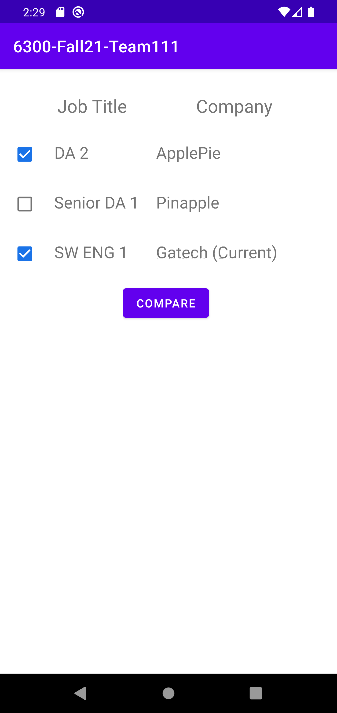   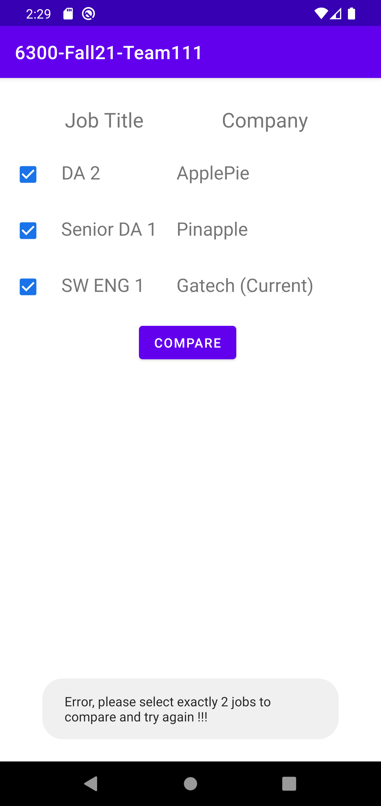   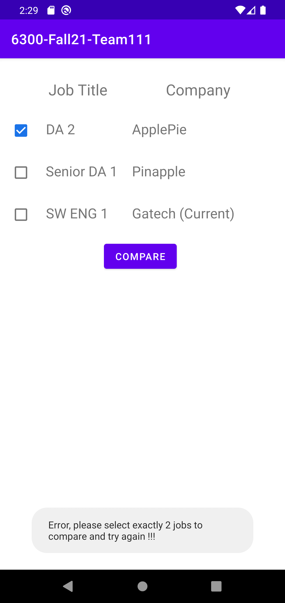

### 10. Option (iv): Offers Comparison Screen - You will see this screen once you are able to successfully click on the "Compare" button in the "Compare Job Offers" screen. This screen shows the side-by-side comparison of the two jobs you selected in the "Compare Job Offers" screen (see image below). On this screen, you also have the option to compare more offers (go back to Compare Job Offers screen) or click on Home which takes you back to Main Menu screen:

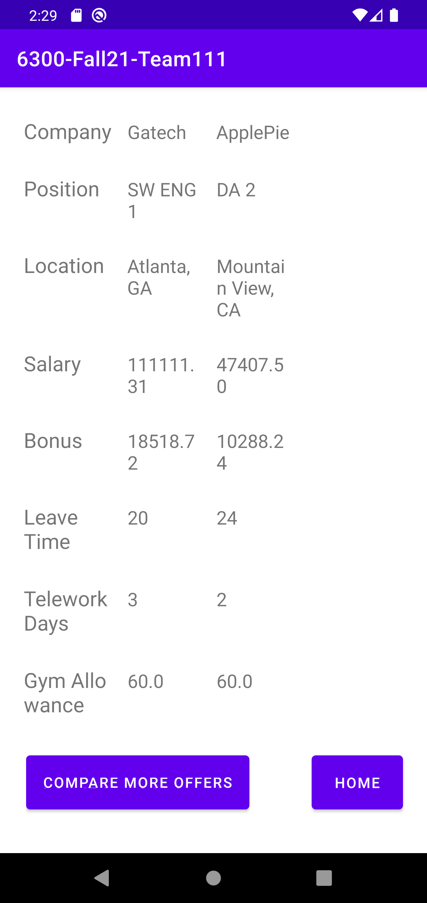

